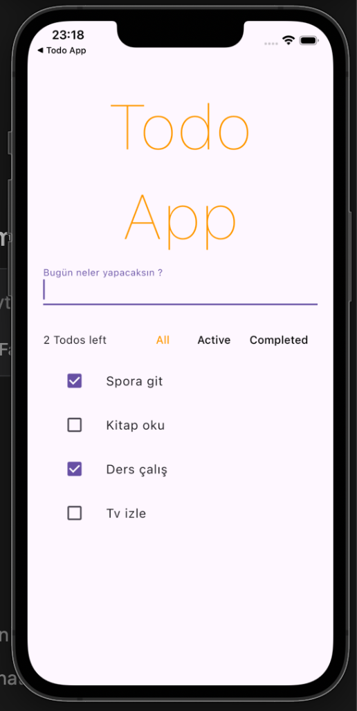

# Flutter Todo App with Riverpod 🚀

Modern ve şık bir Todo uygulaması. Bu proje, Flutter'da **Riverpod** kullanarak nasıl etkili bir state management (durum yönetimi) yapılacağını göstermek amacıyla geliştirilmiştir.

## 📱 Görünüm



## ✨ Özellikler

- **Todo Ekleme:** "Bugün neler yapacaksın?" alanından yeni görevler ekleyebilirsiniz.
- **Todo Listeleme:** Mevcut görevlerinizi liste halinde görüntüleyebilirsiniz.
- **Filtreleme:** Görevlerinizi 'Hepsi', 'Aktif' ve 'Tamamlanmış' olarak filtreleyebilirsiniz.
- **Tamamlama Durumu:** Görevlerin yanındaki onay kutusuna tıklayarak durumlarını güncelleyebilirsiniz.
- **Silme:** Görevleri yana doğru kaydırarak (Dismissible) kolayca silebilirsiniz.
- **Kalan Görev Sayısı:** Tamamlanmamış görev sayısını anlık olarak takip edebilirsiniz.

## 🛠️ Kullanılan Teknolojiler

- **Flutter:** UI Framework
- **Riverpod:** State Management
- **UUID:** Benzersiz kimlik oluşturma
- **State Notifier:** Durum güncellemeleri için

## 🚀 Başlarken

Projeyi yerel makinenizde çalıştırmak için şu adımları izleyin:

1. Bu depoyu klonlayın:

   ```bash
   git clone <repo-url>
   ```

2. Proje dizinine gidin:

   ```bash
   cd state_management
   ```

3. Bağımlılıkları yükleyin:

   ```bash
   flutter pub get
   ```

4. Uygulamayı çalıştırın:
   ```bash
   flutter run
   ```

---

Bu proje öğrenme ve uygulama geliştirme süreçlerini pekiştirmek amacıyla hazırlanmıştır. 💡
